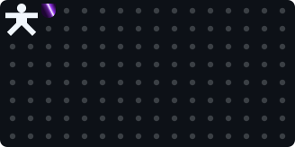

<!-- BREAKME:START -->
## BREAKME.md

<table width="100%">
  <tr>
    <td width="50%" align="left" valign="middle">
      <code>UNLOCKED:</code> 💎 📦 🏆
    </td>
    <td width="50%" align="center" valign="middle">
      
    </td>
  </tr>
</table>

<code>chunk#0 tile#15 streak🔥3 broken: 015</code>
<!-- BREAKME:END -->

<!--
**RVYA/RVYA** is a ✨ _special_ ✨ repository because its `README.md` (this file) appears on your GitHub profile.

Here are some ideas to get you started:

- 🔭 I’m currently working on ...
- 🌱 I’m currently learning ...
- 👯 I’m looking to collaborate on ...
- 🤔 I’m looking for help with ...
- 💬 Ask me about ...
- 📫 How to reach me: ...
- 😄 Pronouns: ...
- ⚡ Fun fact: ...
-->
